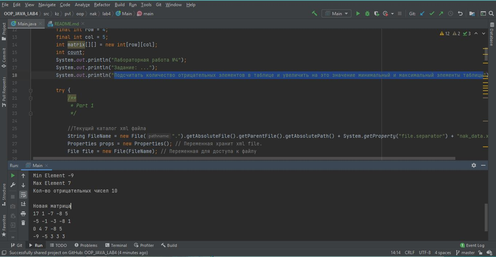

## Laboratory work #4

---
__Задание:__ _Подсчитать количество отрицательных элементов в таблице и 
увеличить на это значение минимальный и максимальный элементы таблицы_

---

---
__Screenshot:__

---